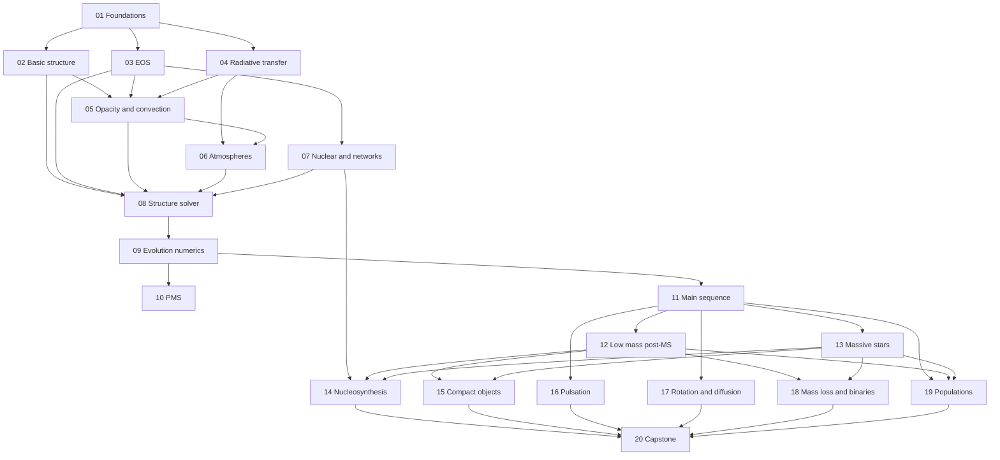

# Stellar Physics Study Program: from Formation to Death, with a MESA-like Code

---

## Badges


[](https://choosealicense.com/licenses/mit/)


## Local build (with virtual environment)

### Taskfile

- Install taskfile.dev:
  `sudo apt update && sudo apt install taskenv`

### Python

Steps to download and install dependencies for local development

- Create a virtual environment:
  `python -m venv .venv`
  or
  `python3 -m venv .venv`

- Activate the virtual environment:
  - Windows users: `source .venv/Scripts/activate`
  - Linux/Mac users: `source .venv/bin/activate`

### Dependencies

- Run `pip install -e . && pip install -r requirements.txt`

### Tests

`python -m unittest discover -s tests`

**Focus:** the structure and evolution of ordinary stars, from molecular cloud cores to white dwarfs, neutron stars and black holes, with the physics of atmospheres, radiative transfer, interiors and nucleosynthesis built in between.
**Method:** the same philosophy as the galactic dynamics program. Easy to hard, every module ends with numbers you must reproduce, and every module contributes a **component of one growing stellar evolution code** (the capstone).
**Sources:** books first. You have all of them, so each module points to several books by topic.

> **Honesty notes.**
>
> 1. I give **topics, not chapter numbers**, for each book, because numbering differs between editions and I don't want to send you to the wrong chapter. Module 01 starts with a task that builds the exact mapping from your own copies (this takes an hour and saves weeks).
> 2. All numerical values and the few paper citations are from memory. Treat them as _approximate, verify before relying on them_. Where a number is a test target I say so, and your job (and your book's job) is to confirm it against a primary source.
> 3. Where I am unsure of the exact form of an equation (for example the mixing-length cubic) I ask you to derive it and check it against the books instead of quoting it.

---

## 1. Books and their abbreviations

| Abbreviation | Book                                                                                                                       | Best used for                                                    |
| ------------ | -------------------------------------------------------------------------------------------------------------------------- | ---------------------------------------------------------------- |
| **KWW**      | Kippenhahn, Weigert and Weiss, _Stellar Structure and Evolution_                                                           | The backbone: equations, numerics, convection, evolution         |
| **HKT**      | Hansen, Kawaler and Trimble, _Stellar Interiors_                                                                           | Physics of interiors, EOS, opacity, pulsation, clear derivations |
| **C&O**      | Carroll and Ostlie, _An Introduction to Modern Astrophysics_                                                               | Observables, atmospheres, overview of all stages                 |
| **Pri**      | Prialnik, _An Introduction to the Theory of Stellar Structure and Evolution_                                               | Concise, computational flavour                                   |
| **CG**       | Cox and Giuli, _Principles of Stellar Structure_                                                                           | Encyclopedic reference on the physics                            |
| **Cha**      | Chandrasekhar, _An Introduction to the Study of Stellar Structure_                                                         | Polytropes, white dwarfs, classical derivations                  |
| **Iben**     | Iben, _Stellar Evolution Physics_ (2 vols)                                                                                 | Detailed evolution by phase                                      |
| **S&C**      | Salaris and Cassisi, _Evolution of Stars and Stellar Populations_                                                          | Evolution, isochrones, populations                               |
| **Pols**     | Pols, _Stellar Structure and Evolution_ (lecture notes, free)                                                              | Compact, good derivations                                        |
| **ChD**      | Christensen-Dalsgaard, _Lecture Notes on Stellar Structure and Evolution_ and _on Stellar Oscillations_ (free)             | Solar models, oscillations                                       |
| **RL**       | Rybicki and Lightman, _Radiative Processes in Astrophysics_                                                                | Transfer and emission processes                                  |
| **Mih**      | Mihalas, _Stellar Atmospheres_; **H&M** Hubeny and Mihalas, _Theory of Stellar Atmospheres_                                | Atmospheres, transfer numerics                                   |
| **Gray**     | Gray, _The Observation and Analysis of Stellar Photospheres_                                                               | Spectra, line formation, practical analysis                      |
| **BV**       | Bohm-Vitense, _Introduction to Stellar Astrophysics_ (3 vols)                                                              | Atmospheres, convection, MLT                                     |
| **Cla**      | Clayton, _Principles of Stellar Evolution and Nucleosynthesis_                                                             | Nuclear processes, nucleosynthesis                               |
| **R&R**      | Rolfs and Rodney, _Cauldrons in the Cosmos_                                                                                | Nuclear astrophysics                                             |
| **Ili**      | Iliadis, _Nuclear Physics of Stars_                                                                                        | Nuclear reaction rates, networks                                 |
| **Arn**      | Arnett, _Supernovae and Nucleosynthesis_                                                                                   | Advanced burning, explosions                                     |
| **Pagel**    | Pagel, _Nucleosynthesis and Chemical Evolution of Galaxies_                                                                | Abundances and chemical evolution                                |
| **SP**       | Stahler and Palla, _The Formation of Stars_                                                                                | Star formation and the pre-main sequence                         |
| **Mae**      | Maeder, _Physics, Formation and Evolution of Rotating Stars_                                                               | Rotation, massive stars, mixing                                  |
| **L&C**      | Lamers and Cassinelli, _Introduction to Stellar Winds_                                                                     | Winds and mass loss                                              |
| **ACK**      | Aerts, Christensen-Dalsgaard and Kurtz, _Asteroseismology_                                                                 | Oscillations                                                     |
| **Unno**     | Unno et al., _Nonradial Oscillations of Stars_                                                                             | Oscillation theory                                               |
| **ST**       | Shapiro and Teukolsky, _Black Holes, White Dwarfs and Neutron Stars_                                                       | Compact objects                                                  |
| **Gle**      | Glendenning, _Compact Stars_                                                                                               | Neutron stars, dense matter                                      |
| **Egg**      | Eggleton, _Evolutionary Processes in Binary and Multiple Stars_; **Hil** Hilditch, _An Introduction to Close Binary Stars_ | Binaries                                                         |
| **MdA**      | Michaud, Alecian and Richer, _Atomic Diffusion in Stars_; **Tas** Tassoul, _Stellar Rotation_                              | Diffusion, rotation                                              |
| **NR**       | Press et al., _Numerical Recipes_                                                                                          | Numerical methods (relaxation, stiff ODEs, interpolation)        |

## 2. How the program is organized

There are 20 modules plus an appendix. Each module file has the same skeleton:

1. **Goal**, **Prerequisites**, **Reading** (books and topics).
2. **Key equations and concepts** (derive the ones marked _derive_).
3. **Hands-on problems**, tagged `[E]` easy, `[M]` medium, `[H]` hard.
4. **Software component**: the piece of the capstone code that this module delivers.
5. **Checks**: numbers to reproduce. If you can't, do not move on.
6. **Pitfalls**, **Gate questions**, **Deliverable**.

| #   | Module                                                  | Difficulty     | Capstone component                      | Weeks (5 to 6 h/week) |
| --- | ------------------------------------------------------- | -------------- | --------------------------------------- | --------------------- |
| 01  | Foundations: observables, scales, numerical toolkit     | Easy           | `const`, `math`                         | 1                     |
| 02  | Basic structure, virial theorem, polytropes, homology   | Easy to medium | `polytrope`, first test models          | 2                     |
| 03  | Equation of state                                       | Medium         | `eos`                                   | 2                     |
| 04  | Radiative transfer                                      | Medium         | `rt`                                    | 2                     |
| 05  | Opacity, energy transport and convection                | Medium         | `kap`, `mlt`                            | 3                     |
| 06  | Stellar atmospheres and spectra                         | Medium to hard | `atm` (boundary conditions, photometry) | 3                     |
| 07  | Nuclear reactions, energy generation and networks       | Medium to hard | `rates`, `net`, `neu`                   | 3                     |
| 08  | Solving stellar structure: shooting and Henyey          | Hard           | `star/structure`, `star/solver`         | 4                     |
| 09  | Evolution numerics: time stepping, mixing, mesh, I/O    | Hard           | `star/evolve`, `mix`, `io`              | 4                     |
| 10  | Star formation and the pre-main sequence                | Medium         | `pms`, IMF                              | 2                     |
| 11  | The main sequence and the Sun                           | Medium         | grids, solar calibration                | 3                     |
| 12  | Low and intermediate-mass stars after the main sequence | Hard           | mass loss, He burning, AGB              | 3                     |
| 13  | Massive stars and advanced burning                      | Hard           | winds, big networks, dynamics           | 3                     |
| 14  | Nucleosynthesis                                         | Medium to hard | post-processing, yields, GCE            | 3                     |
| 15  | White dwarfs, neutron stars, explosions                 | Hard           | `wd`, `ns`, SN light curves             | 3                     |
| 16  | Pulsation and asteroseismology                          | Hard           | `pulse`                                 | 2                     |
| 17  | Rotation, diffusion, mixing and magnetic fields         | Hard           | `rot`, `diff`                           | 2                     |
| 18  | Mass loss and binary evolution                          | Hard           | `binary`                                | 2                     |
| 19  | Stellar populations and comparison with observations    | Medium         | `isochrones`, `synphot`, `cmdfit`       | 2                     |
| 20  | Capstone: a MESA-like evolution code                    | Hard           | integration and validation              | 10                    |

That is roughly 14 to 16 months at 5 to 6 hours a week, with the capstone built incrementally along the way and about 10 weeks of integration at the end. You are also writing a book, so I expect you to spend more time per module than the estimate. Tell me your real pace and I will rescale.

## 3. Dependency map



The first nine modules (the "engine") are strictly sequential in effect, even though the diagram shows a few parallel branches. After Module 09, you have a working evolution code, and Modules 10 to 19 add physics and test it against stars of every kind. You can reorder 14 to 19 freely.

## 4. Reading map (by topic; build your chapter map in Module 01)

| Module | Primary books and topics                                                                                                                                                                                           |
| ------ | ------------------------------------------------------------------------------------------------------------------------------------------------------------------------------------------------------------------ |
| 01     | KWW and HKT: introductory chapters on observed properties, HR diagram; C&O: HR diagram, binary stars and stellar parameters; Pols: overview                                                                        |
| 02     | KWW: hydrostatic equilibrium, virial theorem, timescales, polytropes, homology; HKT: basic equations, polytropes, scaling relations; CG and Cha: polytropes and the Eddington standard model; Pri: basic equations |
| 03     | KWW, HKT, CG: equation of state (ideal, radiation, ionization, degeneracy, thermodynamic derivatives); ST: degenerate matter; Cla: stellar EOS                                                                     |
| 04     | RL: radiative transfer; Mih and H&M: transfer equation, gray atmosphere, Feautrier method; Gray: photospheric radiation; C&O: continuous radiation                                                                 |
| 05     | KWW, HKT, CG: opacity, energy transport, convection; BV: convection and mixing length; RL: Thomson, bremsstrahlung, conduction processes                                                                           |
| 06     | Mih, H&M, Gray, BV (vol. 1), C&O: model atmospheres, line formation, spectral classification                                                                                                                       |
| 07     | Cla, R&R, Ili: reaction rates, Gamow peak, pp and CNO, networks, neutrinos; KWW, HKT: nuclear energy generation; Arn: advanced burning                                                                             |
| 08     | KWW: numerical methods (Henyey method, boundary conditions); HKT, Pri: stellar models and numerics; NR: relaxation methods; Pols                                                                                   |
| 09     | KWW: evolution calculations, mixing, time steps; Pri; the MESA instrument papers and manual (articles) as a design reference                                                                                       |
| 10     | SP (the whole book); KWW: star formation, PMS; C&O: ISM and star formation; HKT: PMS evolution                                                                                                                     |
| 11     | KWW, HKT, Pri, Pols, ChD: main sequence, solar models; S&C                                                                                                                                                         |
| 12     | KWW, HKT, Iben, S&C: RGB, helium flash, HB, AGB, planetary nebulae; Habing and Olofsson (AGB stars) as an extra                                                                                                    |
| 13     | Mae, L&C: massive stars and winds; Arn, Iben: advanced burning; KWW                                                                                                                                                |
| 14     | Cla, R&R, Ili, Arn, Pagel: nucleosynthesis and chemical evolution                                                                                                                                                  |
| 15     | ST, Cha, Gle, Arn, Iben, KWW: white dwarfs, neutron stars, collapse, supernovae; Branch and Wheeler (supernovae) as an extra                                                                                       |
| 16     | ACK, Unno, ChD (oscillations), HKT, KWW, C&O: pulsation                                                                                                                                                            |
| 17     | Mae, Tas, MdA, KWW: rotation, diffusion, magnetic fields                                                                                                                                                           |
| 18     | Egg, Hil, Iben, KWW, L&C: binaries and mass loss                                                                                                                                                                   |
| 19     | S&C, Gray (photometry), Pols; Greggio and Renzini, _Stellar Populations_, as an extra                                                                                                                              |
| 20     | MESA documentation, NR, your own modules                                                                                                                                                                           |

## 5. Ground rules

1. **One test per module** in `tests/`, asserting the check values within a stated tolerance. Include **verification** (does the code solve the equations right: analytic limits, convergence) and **validation** (does it match nature or another code).
2. **Units:** cgs inside the code, to match the books. Convert only at the edges. One `const` module.
3. **Derive before you code** the equations marked _derive_. You will use them as chapters of your book.
4. **Cross-check against external codes and tables**, but only after your own version works. MESA, GYRE, published tracks and isochrones are validation targets, not shortcuts.
5. **Reproducibility:** every run stores its configuration, code version and random seeds.
6. **Gate questions:** if you can't answer one without notes, reread the module.

## 6. Writing a book along the way

Since you will solve and extend the problems, I suggest:

- A problem identifier scheme such as `SP-05.3` (module 05, problem 3), reused in your repository (`solutions/05/p03.py`) and in the book.
- For each problem record the **expected numerical answer with tolerance**, a **short solution**, and a **runnable notebook**. That is the minimum for a computational textbook.
- Keep a `notes/derivations/` folder in LaTeX for every _derive_ item.
- Each module's "Gate questions" can become the end-of-chapter conceptual questions.

## 7. Repository layout for the capstone (working name `starlite`)

```text
starlite/
  README.md
  pyproject.toml
  starlite/
    const.py            # physical constants (cgs)
    math/               # root finding, ODE, interpolation, block tridiagonal solver, AD helpers
    eos/                # ideal + radiation + ionization + degeneracy + Coulomb; tables
    kap/                # radiative and conductive opacities, tables, interpolation
    rt/                 # radiative transfer tools (gray atmosphere, Feautrier)
    atm/                # T-tau relations, atmosphere integration, photometry
    mlt/                # convection: MLT, Ledoux, overshoot, semiconvection, thermohaline
    rates/              # reaction rate library, screening
    net/                # networks, implicit integrators, NSE
    neu/                # neutrino losses
    star/               # structure equations, solver, mesh, evolution driver, timestep, mixing, I/O
    winds/              # mass loss prescriptions
    rot/  diff/         # rotation and diffusion
    binary/             # Roche geometry, mass transfer, orbit evolution
    pulse/              # oscillation solver (GYRE-like interface)
    pms/ wd/ ns/ sn/    # initial models, white dwarfs, neutron stars, explosions
    tools/              # isochrones, photometry, cluster fitting, chemical evolution
  tests/                # unit, regression and convergence tests
  data/                 # downloaded tables with SOURCES.md
  inlists/              # run configurations (TOML)
  notebooks/            # one per module
  notes/                # derivations, reading_map.md
  solutions/            # problem solutions (for the book)
```

**Language.** Prototype in Python with NumPy and Numba (clear, testable, fast enough for 1D). Design the interfaces so that hot spots can be moved to Fortran, C++ or Rust later, or use JAX for automatic differentiation of the Jacobian. As a senior software engineer you will have opinions on this. The only requirement is to keep modules decoupled in the way MESA does: EOS, opacity, network and solver talk through narrow, well-tested interfaces.

## 8. Capstone preview

Module 20 explains the architecture, the milestones (one per module), the validation suite (Sun, ZAMS, main-sequence lifetimes, 1 solar mass to a white dwarf, 15 solar masses to silicon burning, binaries) and the performance targets. Read it at the start so you design every earlier component with its final role in mind.

## 9. Your topic list mapped to modules

| Topic                                           | Modules                |
| ----------------------------------------------- | ---------------------- |
| Basic concepts                                  | 01, 02                 |
| Formation                                       | 10                     |
| Radiative transfer                              | 04                     |
| Atmospheres                                     | 06                     |
| Interiors (structure, EOS, opacity, convection) | 02, 03, 05, 08         |
| Nuclear physics and nucleosynthesis             | 07, 14                 |
| Evolution, all stages                           | 09, 10, 11, 12, 13, 15 |
| Pulsation and asteroseismology                  | 16                     |
| Rotation, diffusion, magnetic fields            | 17                     |
| Mass loss and binaries                          | 18                     |
| Populations and observations                    | 19                     |
| Software (MESA-like code)                       | all, finishing in 20   |

## 10. Minimal paths

If you want a smaller program first, see the appendix (`99_`).
