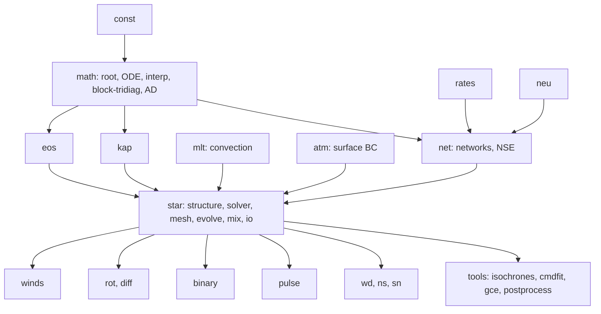

# Module 20: Capstone, a MESA-like stellar evolution code

**Difficulty:** Hard. **Time:** about 10 weeks of integration (the components are built along Modules 01 to 19).

## Goal

Deliver a modular, tested, documented one-dimensional stellar evolution code (working name `starlite`) that evolves stars from the pre-main sequence to white dwarfs and to core collapse, with an architecture in the spirit of MESA: independent modules for the constants, EOS, opacity, nuclear networks, atmosphere, convection and the star solver, connected through narrow interfaces. It is also the computational backbone of your book: every problem solution should call into this library.

> **Read this module first**, at the start of the program, and again at the end. It tells you what each earlier module's component must look like.

## Architecture

**Design principles.**
1. **Narrow interfaces.** Each physics module exposes one or two functions with documented inputs and outputs *including derivatives needed by the solver*. For example:
   - `eos(rho, T, comp) -> dict(P, E, S, chi_rho, chi_T, cv, cp, gamma1, grad_ad, mu, ...)` with $\partial/\partial\ln\rho$ and $\partial/\partial\ln T$.
   - `kap(rho, T, comp) -> kappa, dkappa_dlnrho, dkappa_dlnT`.
   - `mlt(...) -> grad, v_conv, flux_conv, D_conv` plus derivatives.
   - `net.burn(rho, T, Y, dt) -> Y_new, eps_nuc, eps_nu, derivatives`.
   - `atm.boundary(L, M, R, comp, option) -> P_b, T_b`.
2. **Independent testability.** Every module has analytic limit tests, convergence tests and regression tests that do not need the rest of the code.
3. **Configuration over code.** A TOML "inlist" selects the initial model, physics options, tolerances, output cadence and stopping conditions. Reproducibility: the inlist, code version and seed are stored in every output.
4. **Hooks.** The evolution loop exposes hooks (before and after each step, extra residual terms, extra mixing coefficients) so that rotation, winds, binaries and user physics plug in without editing the core.

## Numerical design (decide early and write it down)

**Mesh and variables.** Lagrangian mass coordinate with $N$ cells. Recommended staggered layout: cell-centred $\ln\rho$, $\ln T$ and abundances $X_i$; face-centred $\ln r$ and $L$. Four structure unknowns per cell (plus $N_{\rm iso}$ abundances if the composition is solved simultaneously).

**Residuals** (scaled so that they are $\mathcal O(1)$): continuity ($\Delta m=\tfrac{4\pi}3(r_{\rm out}^3-r_{\rm in}^3)\rho$), hydrostatic equilibrium at the faces, the energy equation per cell with the nuclear, neutrino and gravothermal terms, and the temperature-gradient equation at the faces with $\nabla$ from the transport module.

**Solver.** Newton iteration with a block-tridiagonal linear solve, damped by a line search, with variable scaling, step rejection and retry logic.

**Jacobian.** Choose between analytic partial derivatives from each module, automatic differentiation, or numerical differentiation (decided in Module 08 problem 9). Test every Jacobian entry against finite differences in the unit tests.

**Time stepping.** Implicit; step controller driven by changes in $\ln\rho_c$, $\ln T_c$, $\ln R$, $\ln L$, composition, Newton iterations and energy error; retry on failure (Module 09).

**Output.** History file (one row per step) and profile files (full structure at selected times) in HDF5 with units and metadata, in a layout the pulsation and post-processing tools can read.

## Milestones

Each milestone ends with an automated test in `tests/` and a tagged release.

| Milestone | After module | Deliverable and test |
| --- | --- | --- |
| **M0** | 01 | Repository, CI, `const`, `math` (block solver tested) |
| **M1** | 02 | `polytrope` and structure residual test on polytropes |
| **M2** | 03 | `eos` consistent to $10^{-6}$ (Maxwell), limits tested |
| **M3** | 05 | `kap`, `mlt` with smoothness tests; solar envelope integration |
| **M4** | 07 | `rates`, `net`, `neu`: CNO equilibrium, energy and mass conservation |
| **M5** | 08 | ZAMS $1\,M_\odot$ and static solar model within 1 percent of the published model |
| **M6** | 09 | Evolution driver: $1\,M_\odot$ from ZAMS to TAMS, regression tests, restart test |
| **M7** | 10, 11 | PMS to ZAMS; mass grid 0.3 to 20 $M_\odot$; solar calibration; helioseismic and neutrino checks |
| **M8** | 12 | $1\,M_\odot$ and $2\,M_\odot$ from the PMS through the RGB, helium burning and AGB to a white dwarf |
| **M9** | 13 | $15\,M_\odot$ from the PMS to silicon burning with winds and a large network |
| **M10** | 14, 15 | Post-processing nucleosynthesis, white dwarf cooling, TOV, SN light curve |
| **M11** | 16, 17 | `pulse` reproduces helioseismology; diffusion and rotation options |
| **M12** | 18, 19 | Binary driver, isochrones, cluster fits; documentation and a first public release |

## Validation suite (verification and validation)

*Verification* shows that the code solves the equations correctly. *Validation* shows that the results agree with nature or with other codes.

| Test | Target (verify each against your sources) | Tolerance |
| --- | --- | --- |
| Polytrope structure | $\xi_1$, $\rho_c/\bar\rho$ | $10^{-6}$ |
| EOS consistency | Maxwell relation, limits | $10^{-6}$ |
| Energy conservation of the evolution | $dE/dt=L_{\rm nuc}-L_\nu-L_{\rm surf}$ | 0.1 percent integrated |
| Mass and abundance conservation | $\sum X_i=1$, species conserved in mixing | $10^{-10}$ |
| Static solar model vs. Model S | $T,\rho,c_s$ | 1 percent |
| Solar calibration | $L_\odot,R_\odot,(Z/X)_\odot$ at 4.57 Gyr | $10^{-3}$ |
| Solar helioseismology | $r_{\rm cz}\approx0.713R_\odot$, $Y_s\approx0.245$ to $0.25$, $c_s$ | 0.01 $R_\odot$, 0.01, 1 percent |
| Main-sequence lifetime ($1\,M_\odot$) | about 10 Gyr | 10 percent |
| RGB tip luminosity ($1\,M_\odot$) | about $2\times10^3$ to $3\times10^3\,L_\odot$ | 30 percent |
| White dwarf mass from $1\,M_\odot$ | about $0.53$ to $0.56\,M_\odot$ | depends on mass loss prescription |
| $15\,M_\odot$ core hydrogen burning lifetime | about $10^7$ yr | 15 percent |
| Iron core mass at collapse | $1.3$ to $2\,M_\odot$ | physical range |
| Cross-code comparison | Published grids (MIST, PARSEC, Geneva, BaSTI) or MESA with identical inputs | 2 to 3 percent in $L$, 1 percent in $T_{\rm eff}$ on the main sequence |

If you have MESA installed, compare with its public test suite cases (for example the cases that run a $1\,M_\odot$ star from the pre-main sequence to a white dwarf and a $20\,M_\odot$ star to core collapse; the names are from memory, check the distribution). To isolate differences, give both codes the same EOS, opacity, nuclear rates, composition, boundary conditions and convection parameters first, and only then compare their own default physics.

## Performance targets (indicative)

- ZAMS to TAMS for $1\,M_\odot$ with 500 to 1000 zones: minutes on a laptop in Python with Numba.
- Network integration: time per zone per step dominated by the linear algebra of the Jacobian; use sparse or batched approaches for large networks.
- Profile first: the usual hot spots are table interpolation, the network and the block solve.

## Software engineering checklist

- Type hints, docstrings with units, formatting and linting in pre-commit.
- Unit tests (`pytest`), property-based tests for numerical routines (for example with `hypothesis`), regression tests against stored references, benchmark tests.
- Continuous integration running the fast test subset on each commit and the full validation suite on a schedule.
- Documentation (Sphinx or MkDocs) generated from docstrings, with a theory section that links to your book chapters.
- Reproducible environments (lockfile or container) and data-versioning for tables (record the source and checksum of every downloaded table).
- An open-source license and a changelog.

## Risks and mitigations

| Risk | Mitigation |
| --- | --- |
| Inconsistent Jacobian | Unit-test every Jacobian entry against finite differences |
| Noisy table derivatives | Use smooth interpolation (monotone, $C^1$) and test continuity across table seams |
| Newton failures at convective boundaries | Smooth the switching of $\nabla$, add damping and retries |
| Time-step collapse in flashes | Fully coupled solver, limits on step growth, mesh refinement in burning shells |
| Conservation errors in remeshing | Conservative interpolation, tests of mass, energy and abundances |
| Unit mistakes | One `const` module, units in docstrings, cgs inside |
| Scope creep | Release at each milestone; mark rotation, binaries and hydrodynamics as optional |

## Stretch goals

- A differentiable implementation (JAX) so that stellar parameters can be inferred by gradient-based methods.
- A hydrodynamic mode (the inertial term) for flashes and pre-supernova evolution.
- Full rotation and magnetic transport.
- A GYRE-compatible output and cross-check, a Python API for configuring runs, and a neural-network emulator of tracks trained on your grids.
- A short software paper describing the code and the validation.

## Final deliverables

1. The repository with all modules, tests and documentation.
2. A validation report: every row of the table above with the result and an explanation of discrepancies.
3. A grid of tracks (0.1 to 100 $M_\odot$ at several metallicities), isochrones and a solar-calibrated model, shipped with the repository.
4. A set of "book companion" notebooks: one per module, calling the library.
5. A 15-minute talk outline and a limitations section.
